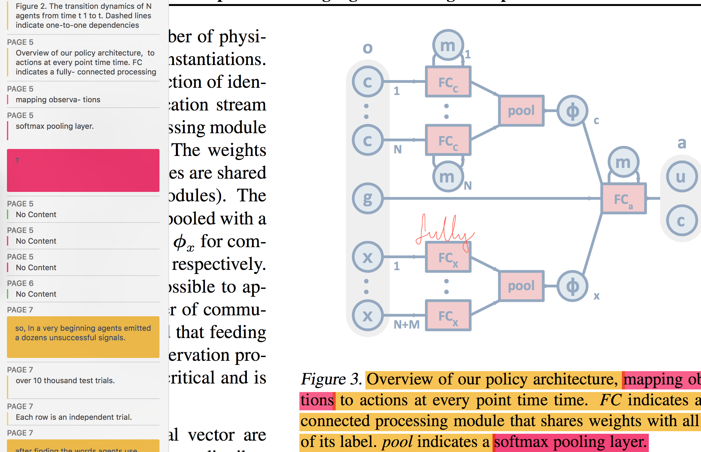

**keys:** _poridge, table spoon, self-motivation, self-destruction, curiosity and related problems, nothing really concrete_

## Abstract

## Intro

How to read such papers:

 - Title
 - Keywords and Abstract
 - Conclusion
 - Graphs and Data Tables
 - Literature
 - Introduction
 - Results and Discussion
 - Methods and Procedures

## Conclusion

## Reference

